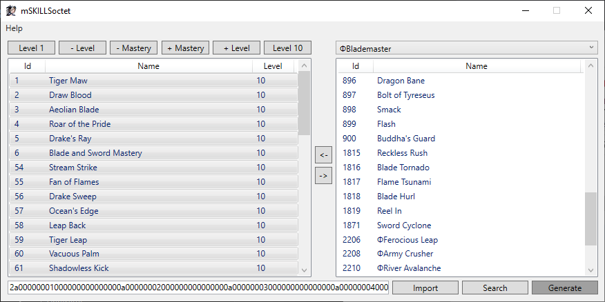

**This project is unmaintained. Issues will not be read and Pull Requests will
not be reviewed or merged. If you desire to make changes to this project, please
fork it to your own repository.**

# mSKILLSoctet

A Minimal Skills Octet Tool for Perfect World.

## What is it?

This is a tool for modifying and generating the skills octet/hex string of a
character's role xml. A charcter's role xml can be modified using something like
iweb or pwAdmin.

This is a "minimal" tool. In other words, the editor only includes basic
functionalities to allow you to modify values.

## Why modify the skills octet?

While this tool is not very useful on a Production server, it has came in handy
to me many times during Development. Personally, I have repeatedly experimented
with the new Primal skills, resulting in me having to learn/unlearn them many
times. Since there is no in game method of unlearning a skill, I developed this
tool to allow me to do so.

## How to edit?

1. Use a tool that can modify role xml, such as iweb or pwAdmin.
2. On a character's role xml, find the skills element.
3. Copy the octet into the editor.
4. Press the Import button.
5. Modify the skills as you see fit. (Use the -/+ Level button to adjust the
   skill's level. Use the -/+ Mastery button for crafting skills. Use the arrow
   buttons to add or remove skill.)
6. Press the Generate button.
7. Copy the generated octet and paste it into the editor, replacing the old
   octet.
8. Save the character's role xml (character must be logged out).

## Who made it?

This tool was made by myself.

There are no documentations on the structure of the skills octet that I am aware
of. However, the structure of the octet is fairly simple, so I was able to
derive it myself.

## Where can it be used?

While I have found editors with similar functionalities, they are all either not
in English, or out of date. For that reason, this editor will load skillstr.txt
to get a list of available skills, as opposed to having them hardcoded. So in
theory, this editor should work on past versions as well as future versions of
the game, as long as the structure of the skills octet remains constant.

However, this was only actually tested on 1.5.3.

You will need the .NET Framework v4.6.1 to run the editor.

## Screenshot

## License

mSKILLSoctet is available under the [GPL license](LICENSE).
